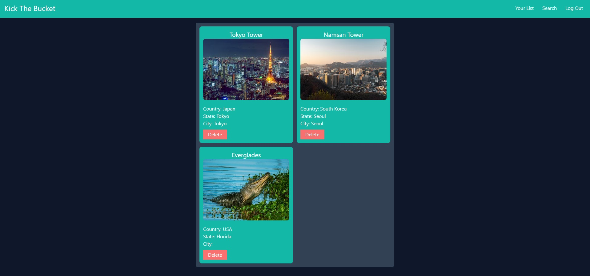

# To Kick the Bucket

## Description
This application was created to allow users to genereate their own u unique user ID that will be  a unique identifyer once they have registered on the application homepage and then prompts htme to enter a destination they would eventually like to travel to. We will show them their selected location, which will be based on the country, city, stae, and landmark they entered and display it on a map for them. They will then have the option to save these locations to their user ID and have their all their favorite destinations displayed on another page for them to then keep track of by adding more(POST), or deleting them once they have competed the trip(DELETE)

## Table of Contents
- [Description](#description)
- [Installation](#installation)
- [Usage](#usage)
- [License](#license)
- [Contributing](#contributing)
- [Tests](#tests)
- [Questions](#questions)

## Installation
To begin the installing of this application, you will need to install packages:
- [Handlebars]
- [Express]
- [Sequelize]
- [Pg]
- [Nodemon]
- [Sessions]
- [Tailwind]

url for the repository on github: https://github.com/philcurtis4/before_you_kick_the_bucket

Screenshot of User Page: 

## Usage
Nodemon

## License
This application is covered by the ***MIT***.

## Contributing
This application was made possible with the use of the Google API, and well as Pexel, image creator along with the respective authors of each package installer

## Tests
N/A

## Questions
Should you have any specific questions regarding my application or would like to compare with my other deployed applcations, contact and general information can be found on my Github homepage found here: GitHub: [@N/A](https://github.com/N/A)
